**Note:**

-An R Notebook is an R Markdown document with chunks that can be executed independently and interactively, with output visible immediately beneath the input.

-Notebook output are available as HTML, PDF, Word, or Latex. 

-This Notebook as HTML is preferably open with Google Chrome.

-R-Code can be extracted as Rmd file under the button "Code" in the notebook.

-This Notebook using iterative development. It means the process starts with a simple implementation of a small set of idea requirements and iteratively enhances the evolving versions until the complete version is implemented and perfect.


____________


<Br>

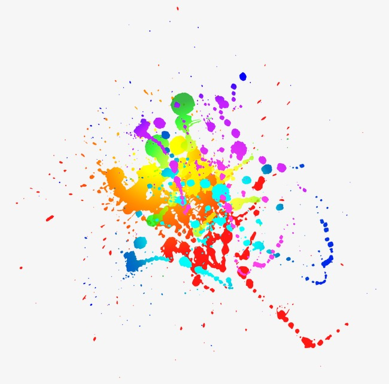

```{r}

#link: https://de.pngtree.com/freepng/vector-color-drop-base-effect_137484.html

```

<Br>

#Learning objectives 

* Why Color Matters

* Choose the right color for insighful visualization

<Br>

#Color Theory 101 

Let's first go back to high school art class to discuss the basics of color.

**Primary Colors:** 

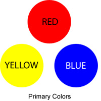


```{r}

#link: https://marketingaccesspass.com/what-colors-make-green-what-two-colors-make-green/

```


It cannot be created by mixing other colors. There are three primary colors:

* **Red**
* **Yellow**
* **Blue**


**Secondary Colors:**

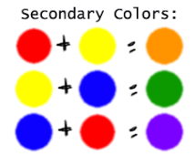

```{r}

#link: https://www.colorpsychology.org/primary-secondary-tertiary-colors/

```


It combined any two of the three primary colors (Red, Yellow, Blue). There are three secondary colors: orange, purple, and green.

* **Red + Yellow = Orange**
* **Blue + Red = Purple**
* **Yellow + Blue = Green**


**Tertiary Colors:**

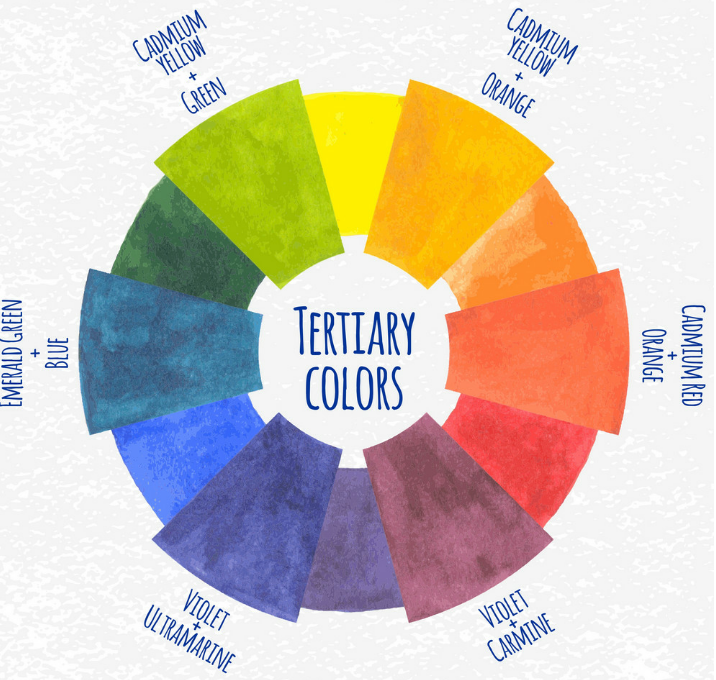

```{r}

#link: https://www.vectorstock.com/royalty-free-vector/watercolor-tertiary-colors-chart-vector-4121992

```


It created when you mix a primary color with secondary color.

There are six tertiary colors that fit this requirement:

* **Red + Purple = Red-Purple (magenta)**
* **Red + Orange = Red-Orange (vermillion)**
* **Blue + Purple = Blue-Purple (violet)**
* **Blue + Green = Blue-Green (teal)**
* **Yellow + Orange = Yellow-Orange (amber)**
* **Yellow + Green = Yellow-Green (chartreuse)**


<Br>

#The Color Theory Wheel

Color wheel is a circle graph that charts each primary, secondary, and tertiary color. The color wheel helps you to visualize the relationships between colors.

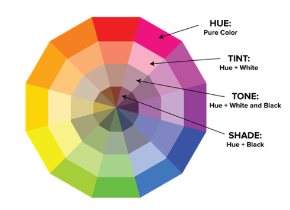


```{r}

#link: https://blog.hubspot.com/marketing/color-theory-design

```

These color wheel create the color variants described below:

* Hue: all of the primary and secondary colors, for instance, are "hues."
* Tint: the opposite of a shade (add white to any given hue)
* Tone (or Saturation): add both white and black to a color to create a tone
* Shade: light and dark versions of the same hue (add black to any given hue)

<Br>

#How to Choose a Color Scheme

**1. Consider your color context.**

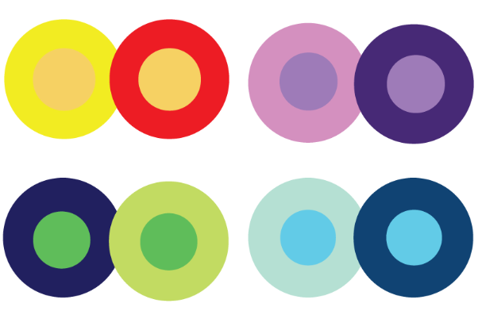

```{r}

#Link: https://blog.hubspot.com/marketing/color-theory-design

```


The contrast with another color. The middle of each of the circles is the same size, shape, and color. The only thing that changes is the background color. There are logical rules for how to create color schemes that work together.


**2. Refer to a color wheel to identify analogous colors.**

Analogous color schemes are formed by pairing one or more color.

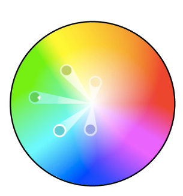

```{r}

#Link: https://blog.hubspot.com/marketing/color-theory-design

```


This color scheme could be create warmer (with yellow) or cooloer (with purple)

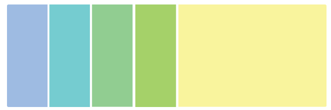

```{r}

#Link: https://blog.hubspot.com/marketing/color-theory-design

```


**3. Refer to a color wheel to identify complementary colors.**

Use of two colors directly across from each other.


```{r}

#Link: https://blog.hubspot.com/marketing/color-theory-design

```


The two across color scheme is also great for graphs. High contrast helps you highlight important points.


```{r}

#Link: https://blog.hubspot.com/marketing/color-theory-design

```


**4. Focus on monochromatic colors in the same hue.**

It created shades and tints in one hue.
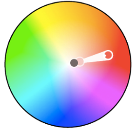

```{r}

#Link: https://blog.hubspot.com/marketing/color-theory-design

```

Example of monochromatic color under the red hue.

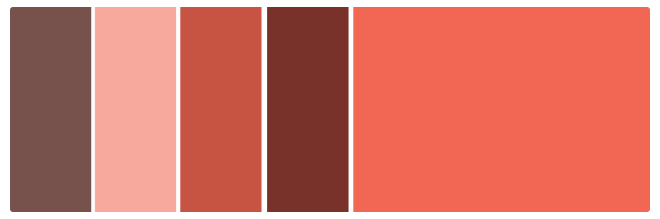

```{r}

#Link: https://blog.hubspot.com/marketing/color-theory-design

```

**5. Use a triadic color scheme to create high contrast.**

Triad color schemes (3 colors) are used to create high contrast between each color.

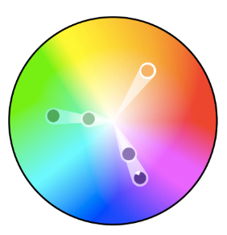

```{r}

#Link: https://blog.hubspot.com/marketing/color-theory-design

```


changing up the intensity of the colors for highlighting important points and terms.

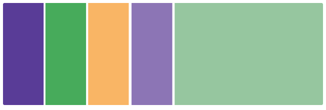

```{r}

#Link: https://blog.hubspot.com/marketing/color-theory-design


```


**6. Create a split complementary color scheme.**

One dominant color and the two colors adjacent to the dominant color's complement.

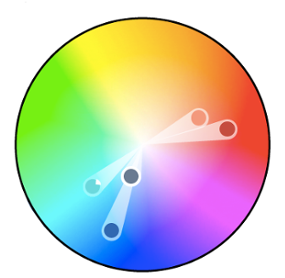

```{r}

#Link: https://blog.hubspot.com/marketing/color-theory-design


```
 
 
An example is like this pallet.

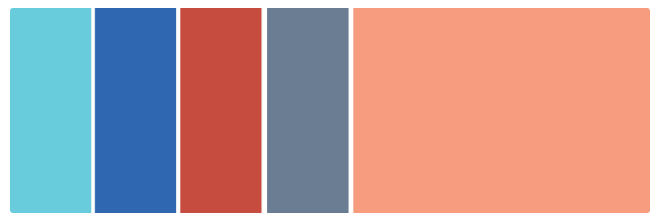

```{r}

#Link: https://blog.hubspot.com/marketing/color-theory-design

```


**7. Think beyond the presets, but start with just one color.**

Extra tips for choosing colors:

* Don't stick with automatically presets color in every program or software. Use the color wheel theory or online color wheel designer
* Start with one color you like
* Save your color schemes
* Practice makes perfect


<Br>

#Logical rules to choosing color

**Defining the basics for choosing colors:**

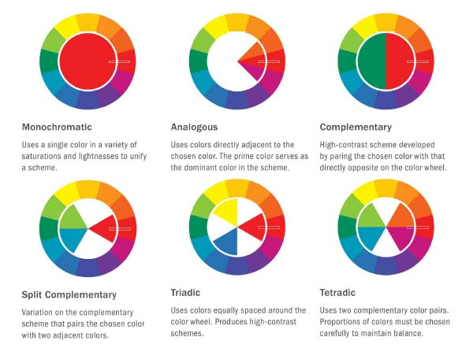

```{r}

#Link: https://coloursandmaterials.wordpress.com/2014/09/16/colour-system/

```

**Below are the explanation of this logical rules:**

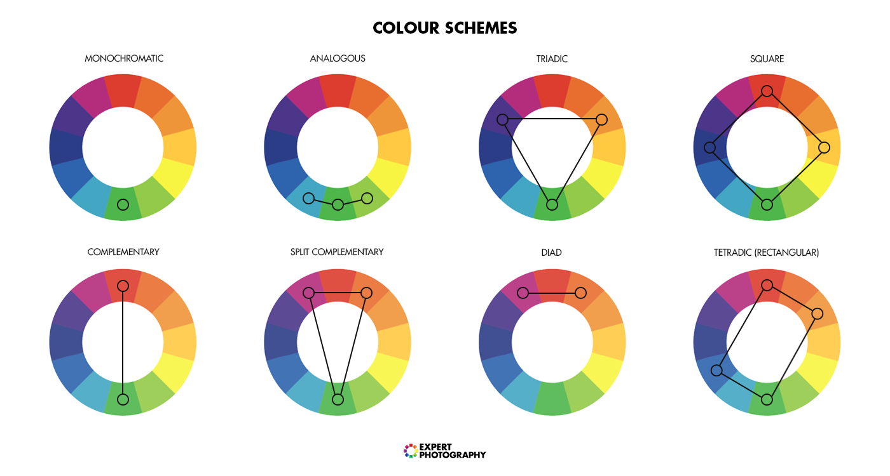

```{r}

#Link: https://expertphotography.com/color-in-photography/

```


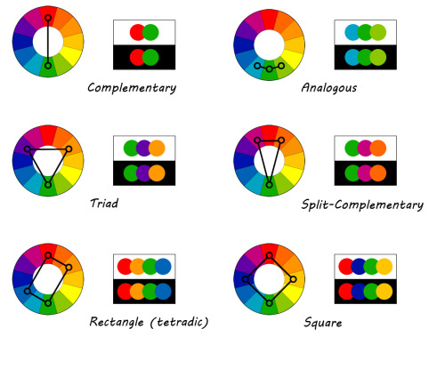

```{r}

#Link: https://mason.gmu.edu/~kshiffl4/375/module5-4.html

```


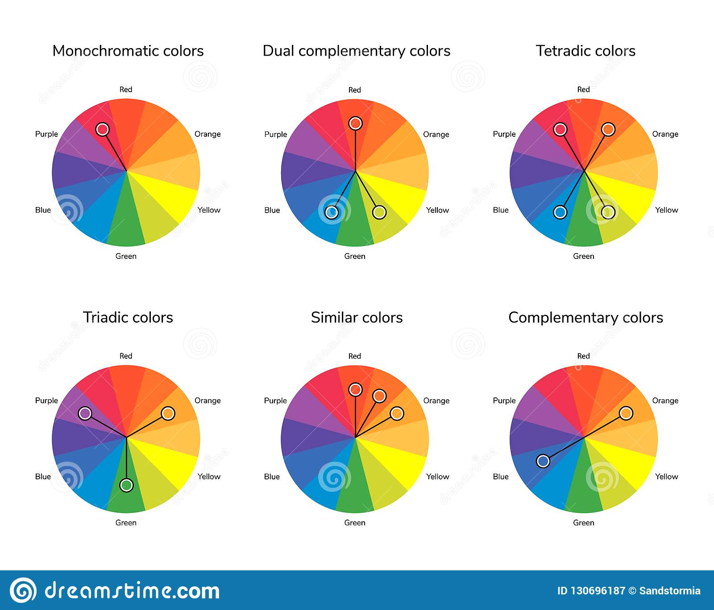

```{r}

#Link: https://www.123rf.com/photo_82958382_stock-vector-vector-illustration-of-color-circle-complementary-analogous-similar-triadic-tetradic-dual-complement.html

```

<Br>

#Colortools: R package

Developed by [Gaston Sanchez](http://www.gastonsanchez.com/) for generating color schemes in R (without leaving R IDE).

**Install and load colortools:**

```{r}

install.packages("colortools")
library(colortools)


```

**Color Wheel:**

Historically, there have been many variations of the basic design, but the most popular version is 12 colors based on the RYB (Red, Yellow, Blue). 

Create color wheels by using the function `wheel` and some given color.

```{r}

# color wheel for 'pink'
wheel("pink")

```

**Analogous (Adjacent) Color Scheme:**

Three colors from a 12 part color wheel.

```{r}

# analogous (adjacent) colors of 'pink'
analogous("pink")

```

**Complementary (Opposite) Color Scheme:**

Oposite colors from the color wheel (2 colors).

```{r}

# complementary (opposite) color of 'pink'
complementary("pink")


```


**Split Complementary Color Scheme:**

Complementary color scheme that uses two colors on either side of a directly opposite color.

```{r}

# split complementary colors of 'pink'
splitComp("pink")

```

**Triadic Color Scheme:**

Three colors from around the color wheel.

```{r}

# triadic colors of 'pink'
triadic("pink")

```

**Tetradic Color Scheme:**

Four colors arranged into two complementary pairs from color wheel.

```{r}

# tetradic colors of 'pink'
tetradic("pink")


```


**Square Color Scheme:**

Similar with tetradic scheme, but with all four colors around the color wheel (not complementary).

```{r}

# square colors of 'pink'
square("pink")


```


**Sequential Colors:**

`sequential` get a sequence of colors from high to low. 

```{r}

# sequential colors of 'pink'
sequential("pink")


```

Another example:

```{r}

# sequential sequence for saturation, with fix value s=0.8, alpha=0.5,
# percentage 10, and fun='log'
sequential("pink", 10, what = "value", s = 0.7, alpha = 0.5, fun = "log")

```


**Small assorment of color palettes:**

A function `pals` contains an assortment of nice color palettes.

```{r}

# color palettes
pals()

```

To get the names of the colors:

```{r}

# color names of palette 'cheer'
pals("fish")

```


Visualize the colors in a 'pizza' wheel:

```{r}

# color names of palette 'cheer'
pizza(pals("fish"))

```


**Visualizing R color palettes:**

A pie chart with given colors.

```{r}

# terrain colors (12)
pizza(terrain.colors(12), bg = "pink")

```


<Br>


#Online color scheme

[Adobe Color (Adobe Kuler)](https://color.adobe.com/de/create/color-wheel/)

[Color Schema Designer](http://colorschemedesigner.com/csd-3.5/)

[Color Calculator](https://www.sessions.edu/color-calculator/)

[Another products](https://www.producthunt.com/alternatives/adobe-kuler)

<Br>


#Change log update

* 25.12.2018

<Br>

#Preferences

* [R package colortools](http://rpubs.com/gaston/colortools)

* [Slide:ology](https://www.duarte.com/books/slideology/)

* [RDocumentation](https://www.rdocumentation.org/)

* [Color Theory Design](https://blog.hubspot.com/marketing/color-theory-design)

* [Statistical tools for high-throughput data analysis](http://www.sthda.com/english/)

<Br>

#License

[The MIT License](https://opensource.org/licenses/MIT)